# Sesion 8

## Practica 1

Para empezar tenemos que irnos al siguiente link

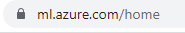

Creamos un nuevo espacio de trabajo 

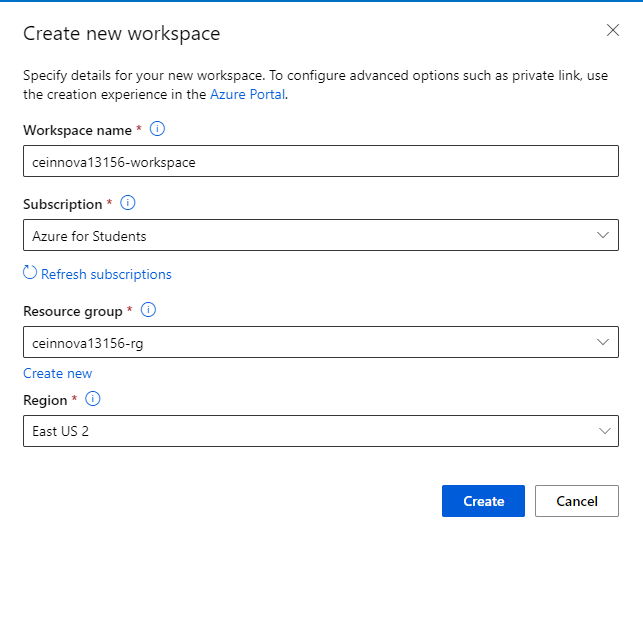

Ahora creamos un conjunto de datos desde un archivo web

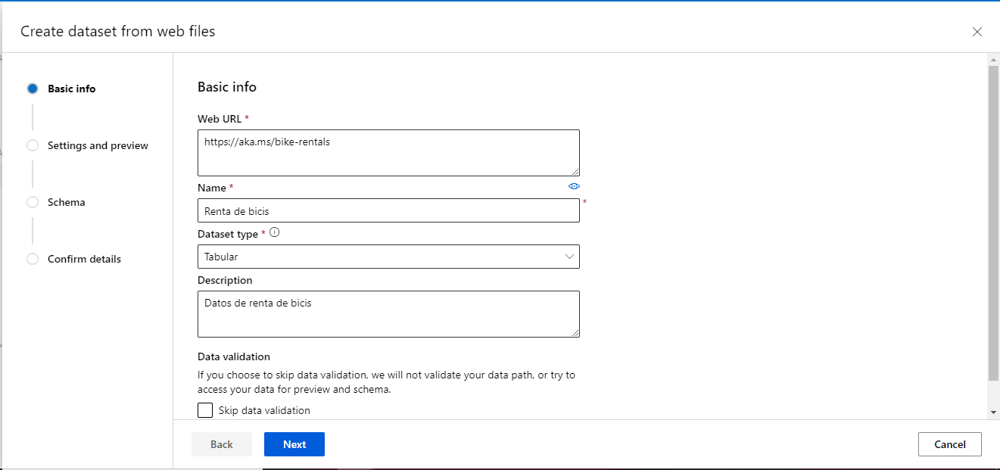

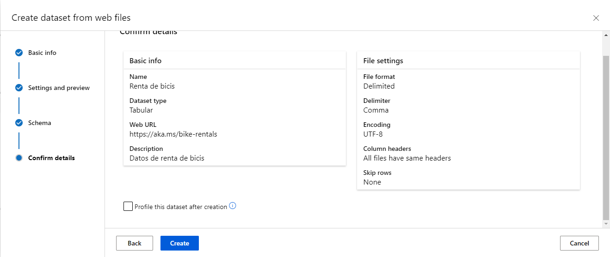

Ahora utilizaremos el ml automatizado

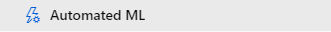

Seleccionamos renta de bicis

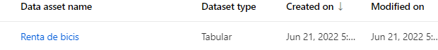

Creamos un cluster de proceso

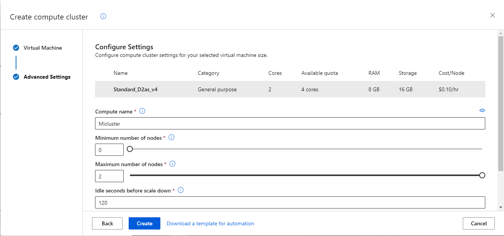

Le damos en finalizar y ya tenemos listo nuestro ml

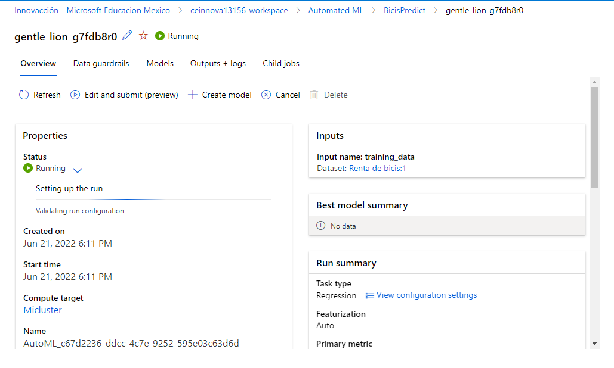

Nos vamos a endpoints y a test

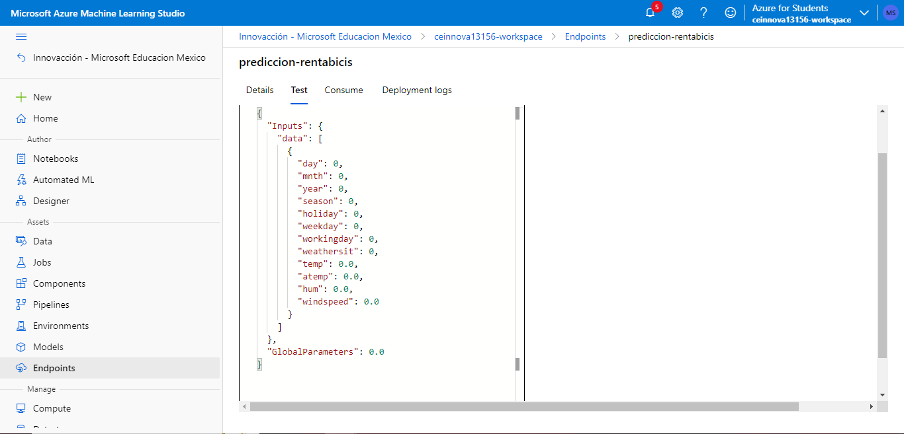

Este seria el resultado

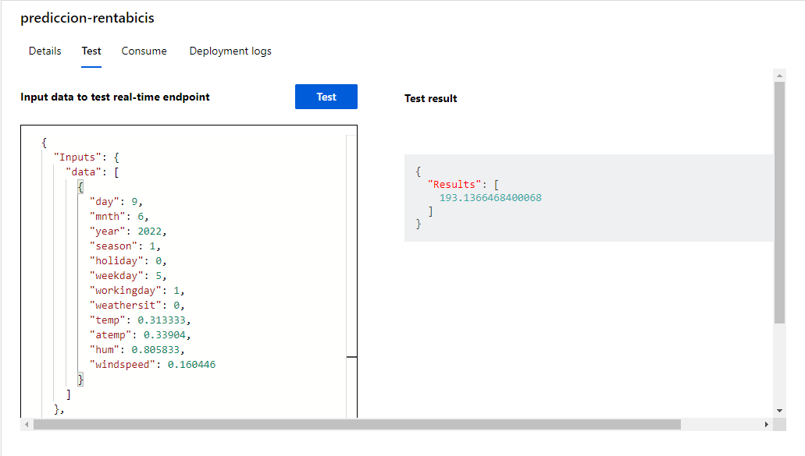

## Practica 2

Creamos un notebook 

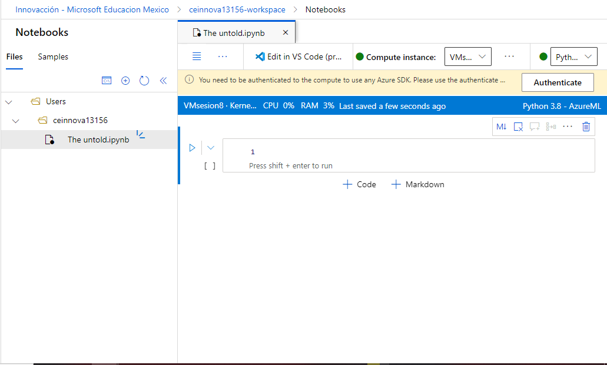

Pegamos el codigo del repositorio en el notebook

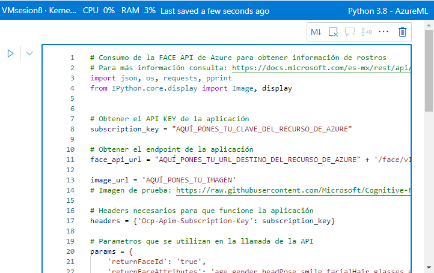

Pegamos el link de una imagen para que la api lo detecte

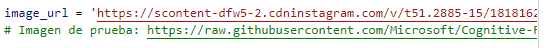

Creamos un recurso para API de face

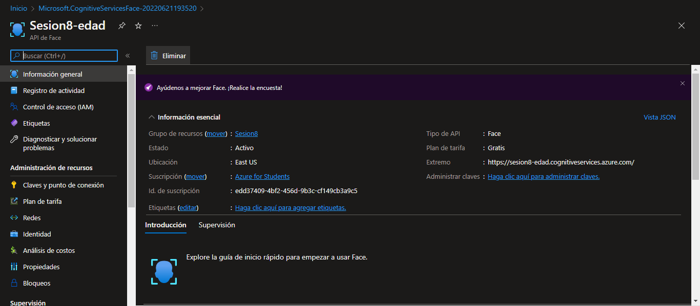

Nos vamos a claves y puntos de conexion y copiamos la clave y el extremo

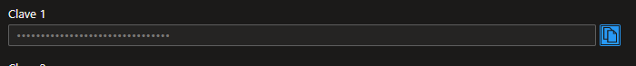

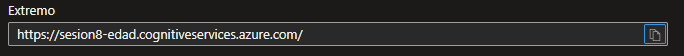

## Practica 3

Entramos al link de custom vision 

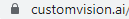

Creamos un nuevo recurso 

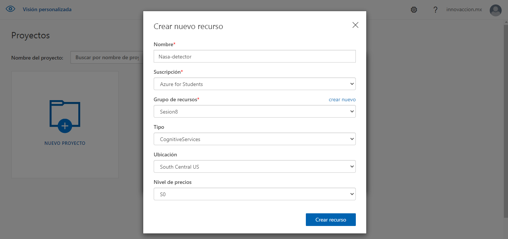

Ahora subiremos nuestra imagen con las galaxias

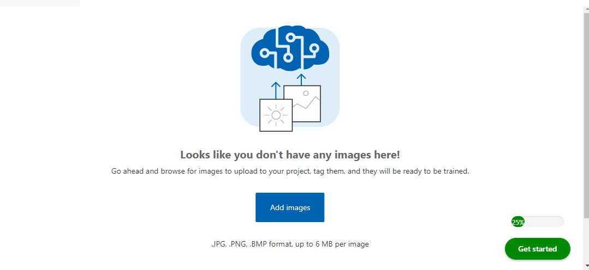

Y este es el resultado del entrenamiento 

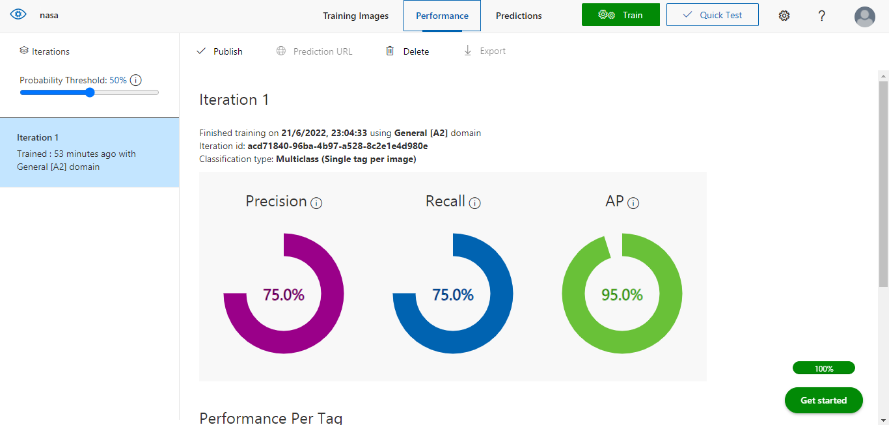

Ya que entrenamos la IA con las imagenes, subiremos una imagen de prueba

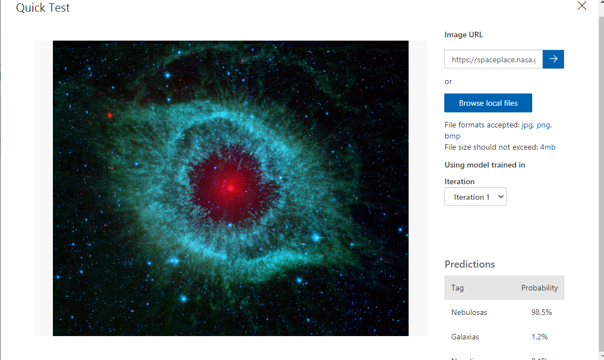

Ahora otro recurso para la deteccion de objetos en las imagenes

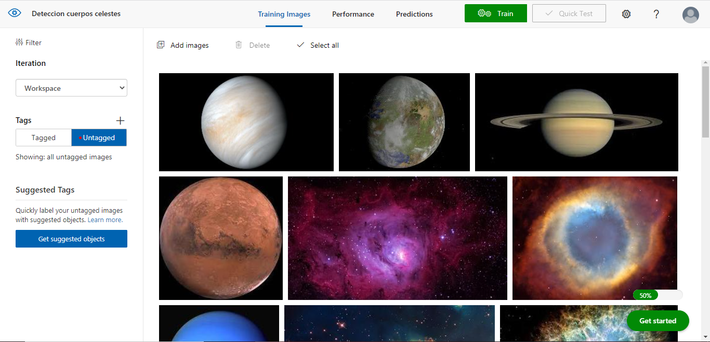

Etiquetamos las imagenes que contegan galaxias para su identificacion 

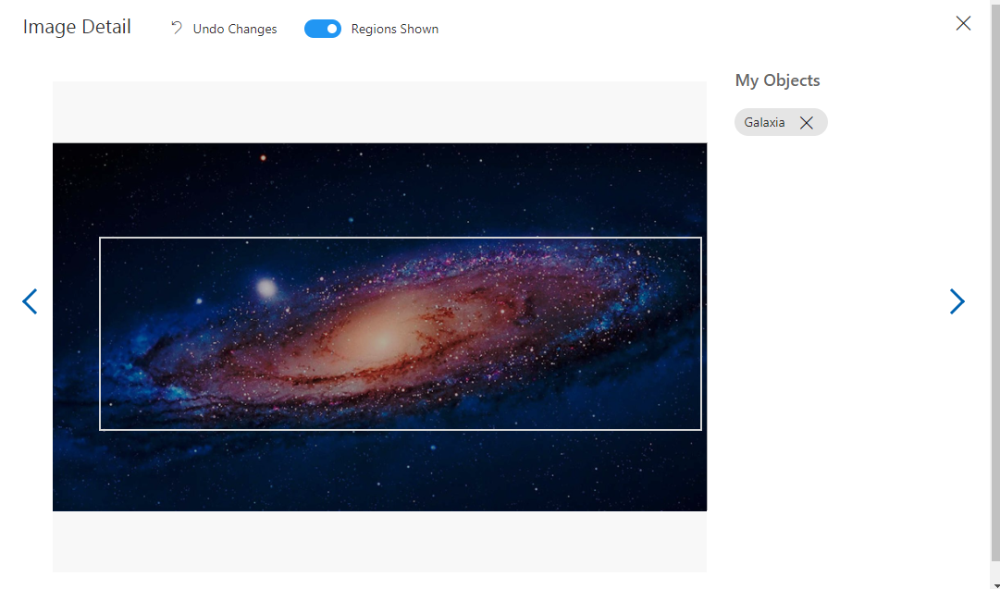

Ahora le damos en el boton de publicar

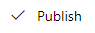

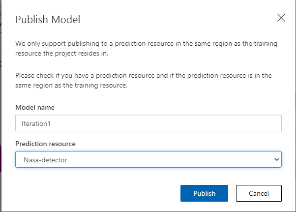

Y se nos generara un link de la API que creamos

## Practica 4

Entramos al siguiente link 

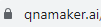

Creamos un QnA service

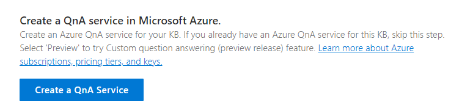

Despues de haber llenado la informacion que nos pedia, le damos en crear

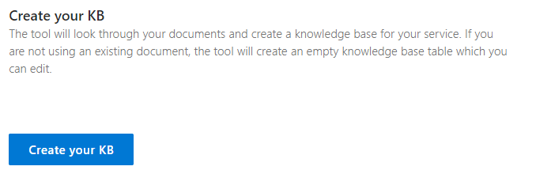

Ahora vamos a generar pares de preguntas y respuestas

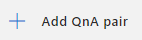

Despues le damos en entrenar

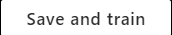

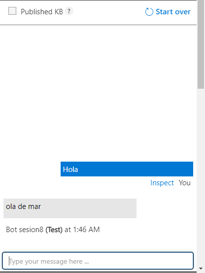

Lo publicamos

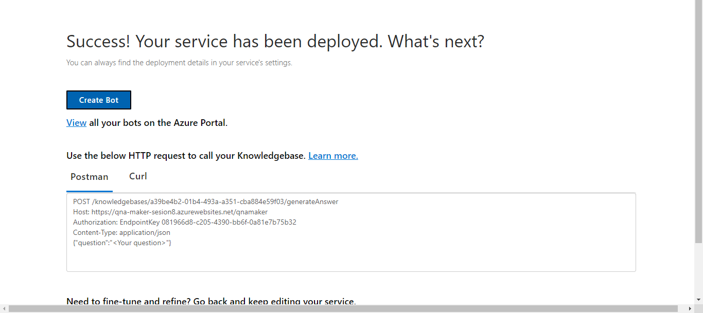

Y lo subimos a azure

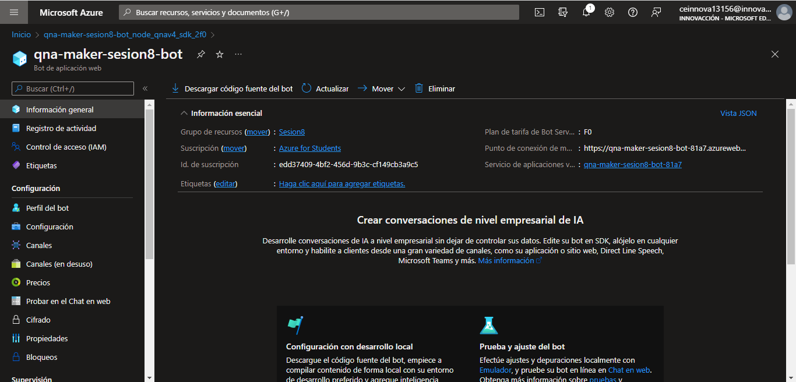

# Sesion8
